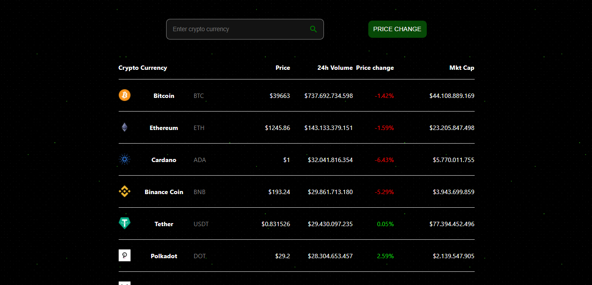
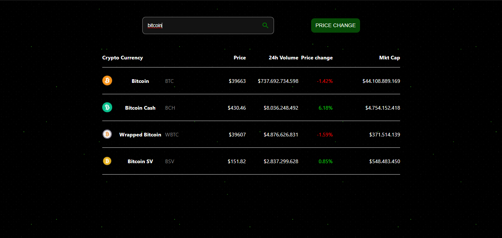

# Cryptocurrency Price Tracker

 
_Cryptocurrency Price Tracker_ is a simple Web application for tracking cryptocurrency prices.
All of the data is fetched using a [public API.](https://www.coingecko.com/en/api#explore-api)
Also, it's possible to filter data using a search bar.

## Built with

- ReactJS
